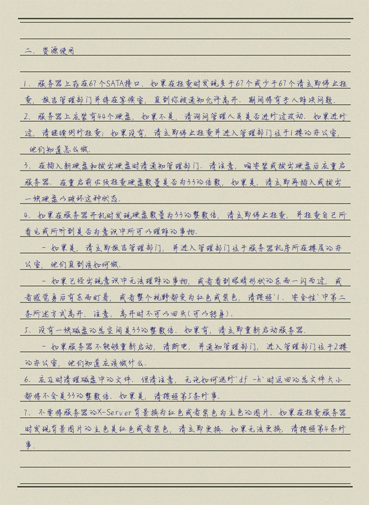

# neverWriteByHand

## Usage

1. put font file and background file into `/src/`
2. set up configs:
    ``` ini
    [DEFAULT]
    size = 4
    txt_path = ./source.txt
    ttf_path = ./src/writeup.TTF
    save_path = ./result/
    white = 0
    fill = #000060FF
    ```
    - `size`: Positive Number, Set the random offset of each character on the paper.
    - `txt_path`: The path of the txt file.
    - `ttf_path`: Font file path (TTF only).
    - `save_path`: Generated image would save into this path. Should be a directory.
    - `while`: If this param set as `True`, a white background-ed image would generated; else, a default background.
    - `fill`: The stroke color(RGBA) of character.

## Override configs

```ini
[OVERRIDE]
background = ./src/backgroundW.png
lines = 28
font_size = 25
startX = 70
startY = 83
gap = 48
length = 925
sizeEn = 13
sizeCn = 22
```
- `background`: Use specific background instead of a built-in one.
- `lines`: The number of lines you want to write.
- `font_size`: The size of font.
- `startX`: The pixel of x where the character would start.
- `startY`: The pixel of y where the character would start.
- `gap`: The gap between lines.
- `length`: The length of the lines.
- `sizeEn`: The size of the half-width characters.
- `sizeCn`: The size of the full-width characters.

## Result



